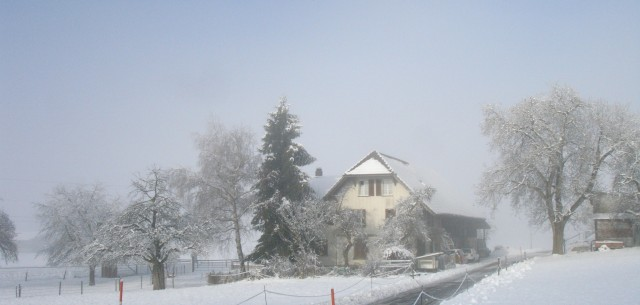
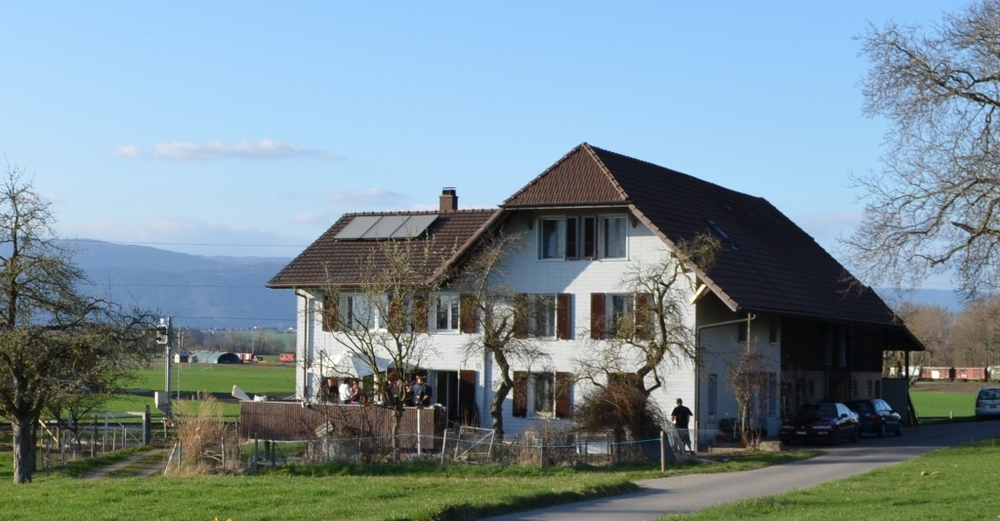
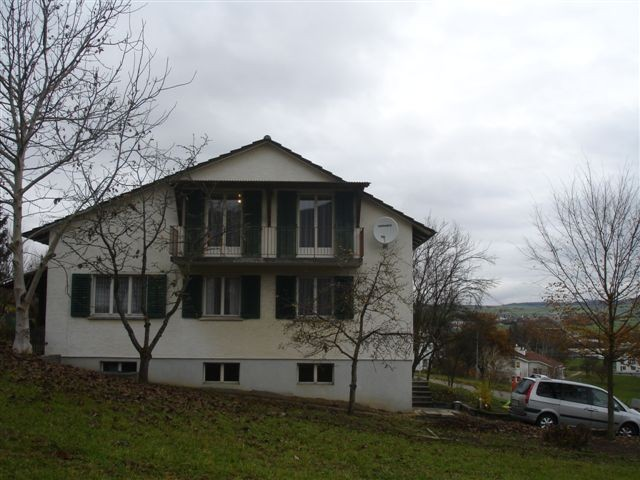
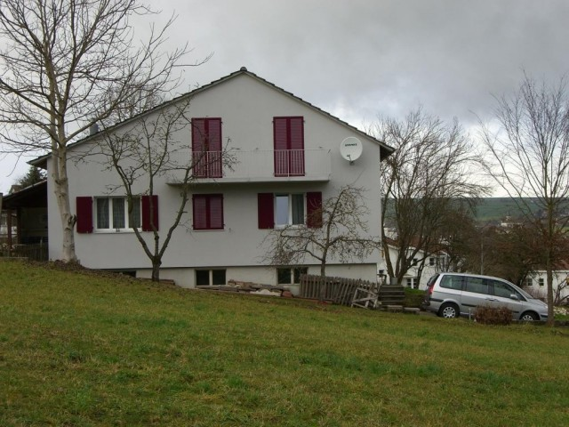

# Referenzen

## Sanierung Bauernhaus, Römerweg 12, Kallnach

Gesamtumbau der 100-jährigen 4 1/2 Zimmer EG Wohnung in eine grosszügige 3 1/2 Zimmer altersgerechte Wohnung, energieeffiziente Sanierung der Fassade und Fenster sowie solarbetriebener Boiler fürs Warmwasser.

### Vorher

### Nachher

Eine Besichtigung nach Absprache ist problemlos möglich und Sabine Mäder heisst Sie herzlich willkommen am Römerweg 12 in Kallnach.

## Sanierung Einfamilienhaus, Taufgarten 18, Neunkirch

Fassade- und Fenstersanierung des EFH um beträchtlich Heizkosten einzusparen.

### Vorher

### Nachher

